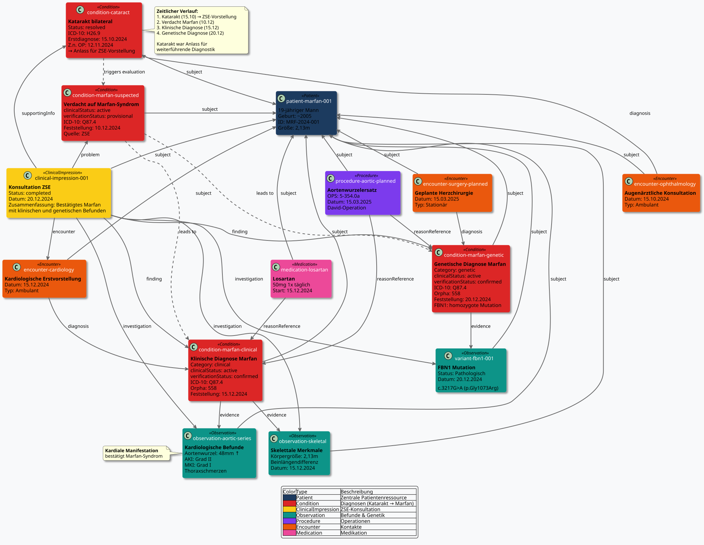
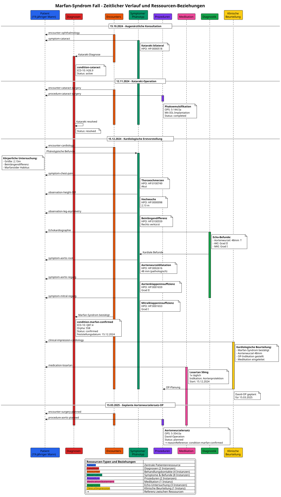

# Fallbeispiel Marfan-Syndrom - MII IG Kerndatensatz-Modul Seltene Erkrankungen v2027.0.0-ballot.rc1

* [**Inhaltsverzeichnis**](toc.md)
* **Fallbeispiel Marfan-Syndrom**

## Fallbeispiel Marfan-Syndrom

# Marfan-Syndrom Fallbeispiel - Semantische Annotationen

## Übersicht

Dieses Dokument enthält die semantischen Annotationen für ein Fallbeispiel eines Marfan-Syndroms bei einem 19-jährigen männlichen Patienten.

## Zeitlicher Verlauf

### 1. Augenärztliche Vorstellung (15.10.2024)

* **Anlass**: Katarakt-Konsultation
* **Befund**: Katarakt beidseits
* **Setting**: Ambulant
* **Weiteres Vorgehen**: OP-Planung

### 2. Katarakt-Operation (12.11.2024)

* **Prozedur**: Phakoemulsifikation mit Linsenimplantation
* **Setting**: Ambulant/Tagesklinik
* **Komplikationen**: Keine
* **Befund**: Erfolgreiche Linsenimplantation

### 3. Kardiologische Erstvorstellung (15.12.2024)

* **Einweisungsgrund**: Thoraxschmerzen, Verdacht auf Marfan-Syndrom
* **Diagnose**: Marfan-Syndrom bestätigt
* **Befunde**: 
* Aortenwurzeldilatation (48mm)
* Aortenklappeninsuffizienz Grad II
* Mitralklappeninsuffizienz Grad I
 
* **Therapie**: Losartan 50mg 1x täglich initiiert

### 4. Geplante Aortenwurzelersatz-OP (15.03.2025)

* **Prozedur**: Composite-Graft-Implantation (David-OP)
* **Setting**: Stationär geplant
* **Indikation**: Progrediente Aortenwurzeldilatation bei Marfan-Syndrom

## Semantische Annotationen

### Patient

* **Geschlecht**: Männlich
* **Geburtsdatum**: ~2005 (19 Jahre alt)
* **Körpergröße**: 2,13 m (pathologisch erhöht)
* **Besonderheiten**: 
* Beinlängendifferenz (rechts verkürzt)
* Marfanoider Habitus
 

### Phänotypische Merkmale

#### Skelettale Manifestationen

1. **Hochwuchs**:
* **HPO**: HP:0000098 "Tall stature"
* **Wert**: 2,13 m
* **Perzentile**: >99. Perzentile

1. **Beinlängendifferenz**:
* **HPO**: HP:0100559 "Lower limb asymmetry"
* **Beschreibung**: Rechtes Bein verkürzt
* **SNOMED CT**: 707738004 "Leg length discrepancy"

#### Kardiovaskuläre Manifestationen

1. **Thoraxschmerzen**:
* **HPO**: HP:0100749 "Chest pain"
* **SNOMED CT**: 29857009 "Chest pain"
* **Onset**: Akut

1. **Aortenwurzeldilatation**:
* **HPO**: HP:0002616 "Aortic root aneurysm"
* **SNOMED CT**: 251036003 "Aortic root dilatation"
* **Messwert**: 48 mm (pathologisch erweitert)

1. **Aortenklappeninsuffizienz**:
* **HPO**: HP:0001659 "Aortic regurgitation"
* **SNOMED CT**: 60234000 "Aortic valve regurgitation"
* **Schweregrad**: Grad II (moderat)

1. **Mitralklappeninsuffizienz**:
* **HPO**: HP:0001653 "Mitral regurgitation"
* **SNOMED CT**: 48724000 "Mitral valve regurgitation"
* **Schweregrad**: Grad I (mild)

#### Ophthalmologische Manifestationen

1. **Katarakt**:
* **HPO**: HP:0000518 "Cataract"
* **ICD-10-GM**: H26.9 "Katarakt, nicht näher bezeichnet"
* **SNOMED CT**: 193570009 "Cataract"
* **Lokalisation**: Bilateral

### Diagnosen

1. **Hauptdiagnose**:
* **Bezeichnung**: Marfan-Syndrom
* **ICD-10-GM**: Q87.4 "Marfan-Syndrom"
* **Orpha**: 558 "Marfan syndrome"
* **SNOMED CT**: 19346006 "Marfan syndrome"
* **OMIM**: 154700
* **Status**: Klinisch bestätigt
* **Feststellungsdatum**: 15.12.2024

1. **Nebendiagnose**:
* **Bezeichnung**: Katarakt
* **ICD-10-GM**: H26.9 "Katarakt, nicht näher bezeichnet"
* **Status**: Operativ behandelt

### Prozeduren

1. **Katarakt-Operation**:
* **OPS-Code**: 5-144.5a "Extrakapsuläre Extraktion der Linse [ECCE]: Phakoemulsifikation: Mit Einführung einer kapselfixierten Hinterkammerlinse, monofokale Intraokularlinse"
* **SNOMED CT**: 54885007 "Phacoemulsification of cataract with intraocular lens implantation"
* **Datum**: 12.11.2024
* **Status**: Abgeschlossen

1. **Geplante Aortenwurzelersatz-OP**:
* **OPS-Code**: 5-354.0a "Andere Operationen an Herzklappen: Aortenklappe: Klappenrekonstruktion"
* **SNOMED CT**: 119564002 "Aortic root replacement"
* **Geplantes Datum**: 15.03.2025
* **Status**: Geplant
* **Technik**: David-Operation (Valve-sparing root replacement)

### Medikation

1. **Losartan**:
* **ATC-Code**: C09CA01
* **Dosierung**: 50 mg
* **Frequenz**: 1x täglich
* **Indikation**: Progressionshemmung der Aortenwurzeldilatation
* **Startdatum**: 15.12.2024
* **SNOMED CT**: 387069000 "Losartan"

### Diagnostische Untersuchungen

#### Echokardiographie (15.12.2024)

1. **Aortenwurzeldurchmesser**:
* **LOINC**: 79992-2 "Aortic root diameter by US"
* **Wert**: 48 mm
* **Interpretation**: Pathologisch erweitert

1. **Aortenklappeninsuffizienz-Grad**:
* **LOINC**: 80140-5 "Aortic valve regurgitation severity by US"
* **Wert**: Grad II
* **Interpretation**: Moderat

1. **Mitralklappeninsuffizienz-Grad**:
* **LOINC**: 80186-8 "Mitral valve regurgitation severity by US"
* **Wert**: Grad I
* **Interpretation**: Mild

### Behandlungsplan

* **Kardiologische Überwachung**: Alle 6 Monate Echokardiographie
* **Medikamentöse Therapie**: Fortführung Losartan
* **Operative Therapie**: Elektive Aortenwurzelersatz-OP am 15.03.2025
* **Genetische Beratung**: Empfohlen für Familienplanung
* **Ophthalmologische Nachsorge**: Post-operative Kontrollen

## FHIR-Mapping

### Verwendete Profile

Die Liste nennt, was die Beispielinstanzen tatsächlich in `meta.profile` deklarieren. Ressourcen ohne Eintrag verwenden bewusst die blanke FHIR-Basisressource: Dieses Modul profiliert, was für seltene Erkrankungen spezifisch ist, und verweist für den Rest auf die Nachbarmodule — Laborwerte gehören ins **Laborbefund**-Modul, Variantenbefunde in den **Molekulargenetischen Befund**. Keines von beiden ist eine Abhängigkeit dieses Moduls, und nichts hier erbt davon.

* **Klinische Diagnose**: `mii-pr-seltene-clinical-diagnosis`
* **Genetische Diagnose**: `mii-pr-seltene-genetic-diagnosis`
* **Therapieempfehlung, medikamentös** (Losartan): `mii-pr-seltene-therapieempfehlung`
* **Therapieempfehlung, nicht-medikamentös**: `mii-pr-seltene-therapieempfehlung-nicht-medikamentoes`
* **Unprofilierte Basisressourcen**: Patient und das Transaktions-Bundle

### Ressourcen-Übersicht

#### Patient und Phänotyp

| | | | | |
| :--- | :--- | :--- | :--- | :--- |
| `mii-exa-seltene-patient-marfan-001` | Patient | 19-jähriger Mann | Geburt: ~2005 | ID: MRF-2024-001 |
| `mii-exa-seltene-observation-height-001` | Observation | Körpergröße | 15.12.2024 | 2,13 m (HPO:0000098) |
| `mii-exa-seltene-observation-leg-asymmetry` | Observation | Beinlängendifferenz | 15.12.2024 | Rechts verkürzt (HPO:0100559) |

#### Symptome und Befunde

| | | | | | |
| :--- | :--- | :--- | :--- | :--- | :--- |
| `mii-exa-seltene-symptom-chest-pain` | Observation | Thoraxschmerzen | 15.12.2024 | HP:0100749 | Akut |
| `mii-exa-seltene-symptom-aortic-root` | Observation | Aortenwurzeldilatation | 15.12.2024 | HP:0002616 | 48mm |
| `mii-exa-seltene-symptom-aortic-regurg` | Observation | Aortenklappeninsuffizienz | 15.12.2024 | HP:0001659 | Grad II |
| `mii-exa-seltene-symptom-mitral-regurg` | Observation | Mitralklappeninsuffizienz | 15.12.2024 | HP:0001653 | Grad I |
| `mii-exa-seltene-symptom-cataract` | Observation | Katarakt bilateral | 15.10.2024 | HP:0000518 | Bilateral |

#### Diagnosen

| | | | | | |
| :--- | :--- | :--- | :--- | :--- | :--- |
| `mii-exa-seltene-condition-marfan-genetic` | Condition | Marfan-Syndrom | 15.12.2024 | Q87.4 | 558 |
| `mii-exa-seltene-condition-cataract` | Condition | Katarakt bilateral | 15.10.2024 | H26.9 | - |

#### Prozeduren

| | | | | | |
| :--- | :--- | :--- | :--- | :--- | :--- |
| `mii-exa-seltene-procedure-cataract-surgery` | Procedure | Phakoemulsifikation mit IOL | 12.11.2024 | 5-144.5a | Abgeschlossen |
| `mii-exa-seltene-procedure-aortic-planned` | Procedure | Aortenwurzelersatz (David-OP) | 15.03.2025 | 5-354.0a | Geplant |

#### Medikation

| | | | | | |
| :--- | :--- | :--- | :--- | :--- | :--- |
| `mii-exa-seltene-medication-losartan` | MedicationStatement | Losartan | 50mg 1x täglich | 15.12.2024 | Aortenprotektion |

#### Diagnostik

| | | | | |
| :--- | :--- | :--- | :--- | :--- |
| `mii-exa-seltene-observation-echo-aortic` | Observation | Aortenwurzel-Echo | 15.12.2024 | 48mm (pathologisch) |
| `mii-exa-seltene-observation-echo-av` | Observation | AK-Insuffizienz Echo | 15.12.2024 | Grad II |
| `mii-exa-seltene-observation-echo-mv` | Observation | MK-Insuffizienz Echo | 15.12.2024 | Grad I |

#### Behandlungskontakte

| | | | | | |
| :--- | :--- | :--- | :--- | :--- | :--- |
| `mii-exa-seltene-encounter-ophthalmology` | Encounter | Augenärztliche Konsultation | 15.10.2024 | Ambulant | Ophthalmologie |
| `mii-exa-seltene-encounter-cataract-surgery` | Encounter | Katarakt-OP | 12.11.2024 | Tagesklinik | Ophthalmologie |
| `mii-exa-seltene-encounter-cardiology` | Encounter | Kardiologische Erstvorstellung | 15.12.2024 | Ambulant | Kardiologie |
| `mii-exa-seltene-encounter-surgery-planned` | Encounter | Geplante Herzchirurgie | 15.03.2025 | Stationär | Herzchirurgie |

#### Klinische Beurteilungen

| | | | | |
| :--- | :--- | :--- | :--- | :--- |
| `mii-exa-seltene-clinical-impression-seltene-assessment` | ClinicalImpression | Kardiologische Beurteilung | 15.12.2024 | Marfan bestätigt, OP-Indikation |

### Bundle

| | | | |
| :--- | :--- | :--- | :--- |
| `mii-exa-seltene-bundle-marfan-complete` | Bundle | Transaction Bundle mit allen Ressourcen | 20 Ressourcen |

## Implementierung

Die vollständigen FHIR-Ressourcen sind in den FSH-Quellen dieses Moduls definiert (`input/fsh/Beispiel_Marfan/`), inklusive Transaction Bundle.

### Ressourcen-Diagramme

#### Gesamtübersicht aller Ressourcen und Beziehungen

#### Zeitlicher Verlauf

