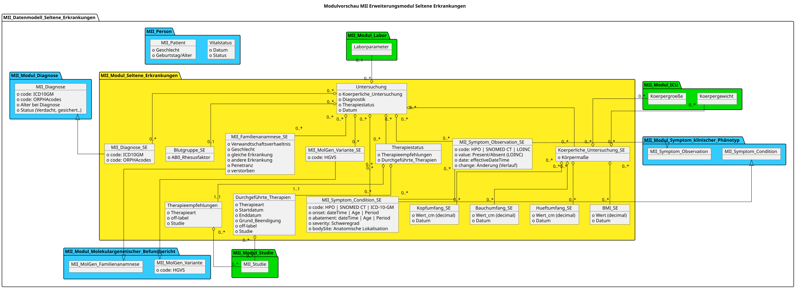

# UML-Diagramme - MII IG Kerndatensatz-Modul Seltene Erkrankungen v2027.0.0-ballot.rc1

* [**Inhaltsverzeichnis**](toc.md)
* [**Anleitung**](guidance.md)
* **UML-Diagramme**

## UML-Diagramme

 Diese Seite enthält Übersetzungen aus der Originalsprache, in der der Leitfaden verfasst wurde. Informationen zu diesen Übersetzungen und Anweisungen zum Abgeben von Feedback zu den Übersetzungen finden Sie [hier](translationinfo.md). 

 

Das Bild ist [hier](MII_Datenmodell_Seltene_Erkrankungen_logisch.svg) in zoombarer Form abrufbar.

