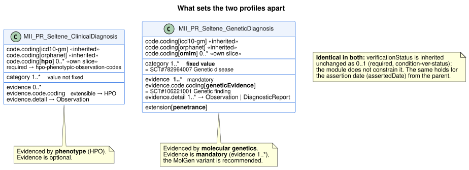
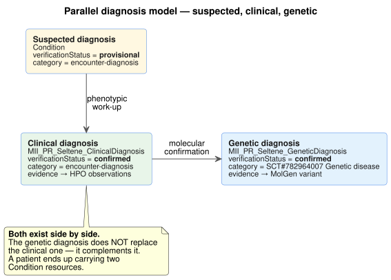
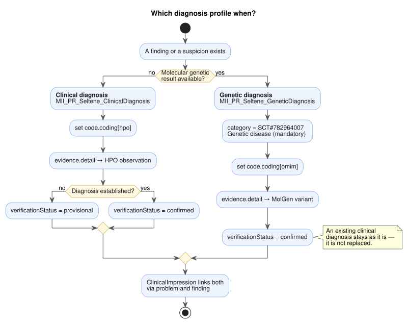

# Klinische vs. genetische Diagnose - MII IG Kerndatensatz-Modul Seltene Erkrankungen v2027.0.0-ballot.rc1

* [**Inhaltsverzeichnis**](toc.md)
* [**Anleitung**](guidance.md)
* **Klinische vs. genetische Diagnose**

## Klinische vs. genetische Diagnose

# Leitfaden: Klinische vs. Genetische Diagnose bei Seltenen Erkrankungen

## Übersicht

In der Modellierung seltener Erkrankungen unterscheiden wir zwischen zwei Arten der Diagnosestellung:

1. **Klinische Diagnose**(`MII_PR_Seltene_ClinicalDiagnosis`) - Basierend auf phänotypischen Merkmalen
1. **Genetische Diagnose**(`MII_PR_Seltene_GeneticDiagnosis`) - Molekulargenetisch bestätigt

Diese Unterscheidung ist wichtig, da viele seltene Erkrankungen zunächst klinisch vermutet und später genetisch bestätigt werden.

## Klinische Diagnose

### Verwendung

Die klinische Diagnose wird verwendet, wenn:

* Die Diagnose auf klinischen Befunden und Symptomen basiert
* Eine genetische Testung noch aussteht oder nicht verfügbar ist
* Die Diagnose phänotypisch gestellt wird (z.B. bei charakteristischen Syndromen)

### Besonderheiten

* **HPO-Codes**: Zusätzlicher Slice `code.coding[hpo]` (0..*), required gebunden an das ValueSet der HPO-Phänotypcodes
* **Phänotypische Evidenz**: Evidence.detail verweist auf HPO-kodierte Symptom-Observations
* **Verifikationsstatus**: Vom Profil **nicht** eingeschränkt (0..1, geerbte required- Bindung an `condition-ver-status`); empfohlen "provisional" oder "differential", solange die genetische Bestätigung aussteht
* **Kategorie**: `category` ist Pflicht (1..*), der Wert bleibt frei. Er beschreibt die Rolle im Record (`problem-list-item` oder `encounter-diagnosis`), nicht die Art der Erkrankung — eine modulweite Bindung an Krankheitsarten waere hier fachlich falsch.

### Strukturvergleich

Die ausformulierten Instanzen stehen als Beispiele bei den Profilen selbst; hier geht es um den Unterschied, nicht um die Syntax.

## Genetische Diagnose

### Verwendung

Die genetische Diagnose wird verwendet, wenn:

* Die Diagnose durch molekulargenetische Untersuchung bestätigt wurde
* Pathogene Varianten identifiziert wurden
* Eine eindeutige genetische Ursache nachgewiesen ist

### Besonderheiten

* **OMIM-Codes**: Zusätzlicher Slice für Online Mendelian Inheritance in Man Codes
* **Genetische Evidenz**: `evidence` ist Pflicht (1..**), `evidence.detail` (1..**) verweist auf Observation oder DiagnosticReport. Das Profil schreibt die Zielprofile nicht vor; empfohlen sind die MolGen-Ressourcen: 
* `MII_PR_MolGen_Variante` für einzelne Varianten
* `MII_PR_MolGen_DiagnostischeImplikation` für umfassende genetische Berichte
 
* **Genetische Evidenz-Kennzeichnung**: `evidence.code.coding[geneticEvidence]` trägt `106221001 | Genetic finding |`
* **Verifikationsstatus**: Vom Profil **nicht** eingeschränkt; empfohlen "confirmed"
* **Genetische Zusatzinformation**: Extension `penetrance`
* **Kategorie**: PFLICHT: `782964007 | Genetic disease |` zur eindeutigen Kennzeichnung

## Paralleles Diagnosemodell

Bei seltenen Erkrankungen existieren klinische und genetische Diagnosen **parallel** zueinander:

Das Diagramm zeigt die drei Stufen: Verdachtsdiagnose aus Screening oder Erstkontakt, klinische Diagnose nach phänotypischer Abklärung, genetische Diagnose nach molekulargenetischer Bestätigung.

**Wichtig:** Die genetische Diagnose ersetzt NICHT die klinische Diagnose. Beide existieren parallel und ergänzen sich gegenseitig.

## Entscheidungsbaum

## Praktische Hinweise

### Wann welches Profil verwenden?

| | | |
| :--- | :--- | :--- |
| Neugeborenenscreening positiv | ClinicalDiagnosis | unconfirmed |
| Klinisch eindeutiges Syndrom | ClinicalDiagnosis | provisional |
| Genetisch bestätigt | GeneticDiagnosis | confirmed |
| Klinisch + genetisch bestätigt | **Beide Profile parallel** | confirmed |
| **Ausgeschlossene Diagnose** | Entsprechendes Profil | **refuted** |
| Differentialdiagnose | ClinicalDiagnosis | differential |

### Verlinkung zwischen Diagnosen mittels ClinicalImpression

Die **ClinicalImpression** verbindet die verschiedenen Diagnosestadien:

1. **problem**: Verweis auf die Verdachtsdiagnose (Grund der Untersuchung)
1. **finding**: Verweise auf die bestätigten Diagnosen (klinisch UND genetisch)
1. **investigation**: Verweise auf durchgeführte Untersuchungen

Beide Diagnosen bleiben als eigenständige Ressourcen erhalten und dokumentieren verschiedene Aspekte derselben Erkrankung.

### Evidence-Verlinkung

**Klinische Diagnose:**

* Evidence → Observation mit HPO-kodierten Symptomen
* Evidence → DiagnosticReport mit klinischen Befunden
* Evidence → ClinicalImpression mit klinischer Beurteilung

**Genetische Diagnose:**

* Evidence → MolGen Variante (Observation)
* Evidence → MolGen DiagnostischeImplikation (DiagnosticReport)
* Evidence → MolGen Untersuchte Region (Observation)

## Validierung

### Checkliste Klinische Diagnose

* `category` gesetzt — **Pflicht** (1..*)
* HPO-Code in `code.coding[hpo]`, sofern der Phänotyp bekannt ist (das Profil erzwingt ihn nicht, für seltene Erkrankungen ist er aber der eigentliche Gehalt)
* `evidence.detail` mit Verweis auf phänotypische Observations
* Angemessener `verificationStatus`

### Checkliste Genetische Diagnose

* `category` = `782964007 | Genetic disease |` — **Pflicht**, fester Wert
* Mindestens eine `evidence` mit `evidence.detail` — **Pflicht** (1..*)
* OMIM-Code, wenn verfügbar
* `evidence.code.coding[geneticEvidence]` = `106221001 | Genetic finding |`
* `verificationStatus = confirmed` bei bestätigter Diagnose

## Ausgeschlossene Diagnosen

### Wichtiger Hinweis

**Ausgeschlossene Diagnosen (refuted) MÜSSEN ebenfalls dokumentiert werden!**

Bei seltenen Erkrankungen ist die Dokumentation ausgeschlossener Diagnosen essentiell für:

* Vermeidung redundanter Diagnostik
* Dokumentation des diagnostischen Prozesses
* Unterstützung bei Differentialdiagnosen
* Forschung und Registerdaten

### Modellierung ausgeschlossener Diagnosen

Ausgeschlossene Diagnosen nutzen dasselbe Profil wie bestätigte; unterschieden wird allein über den Status:

| | | |
| :--- | :--- | :--- |
| Profil | `MII_PR_Seltene_ClinicalDiagnosis` | `MII_PR_Seltene_GeneticDiagnosis` |
| `verificationStatus` | `refuted` | `refuted` |
| `clinicalStatus` | `inactive` | `inactive` |
| Begründung | `note.text` | `note.text` |
| Evidenz | negativer phänotypischer Befund | negativer molekulargenetischer Befund |

### Best Practices für ausgeschlossene Diagnosen

1. **Immer dokumentieren wenn:**
* Eine Verdachtsdiagnose widerlegt wurde
* Genetische Tests negativ sind
* Differentialdiagnosen ausgeschlossen werden

1. **Pflichtangaben:**
* `verificationStatus = refuted`
* `clinicalStatus = inactive`
* Begründung in `note.text`
* Evidence wenn vorhanden

1. **Zeitliche Dokumentation:**
* `recordedDate`: Wann wurde ausgeschlossen
* `abatementDateTime`: Zeitpunkt des Ausschlusses

## Beispiele

Vollständige Beispiele finden sich in:

* [SMA-Fallbeispiel](sma-example-annotations.md) - Diagnose-Verlauf von Screening bis genetischer Bestätigung
* [Marfan-Fallbeispiel](marfan-example-annotations.md) - Klinische Diagnose mit phänotypischen Merkmalen

