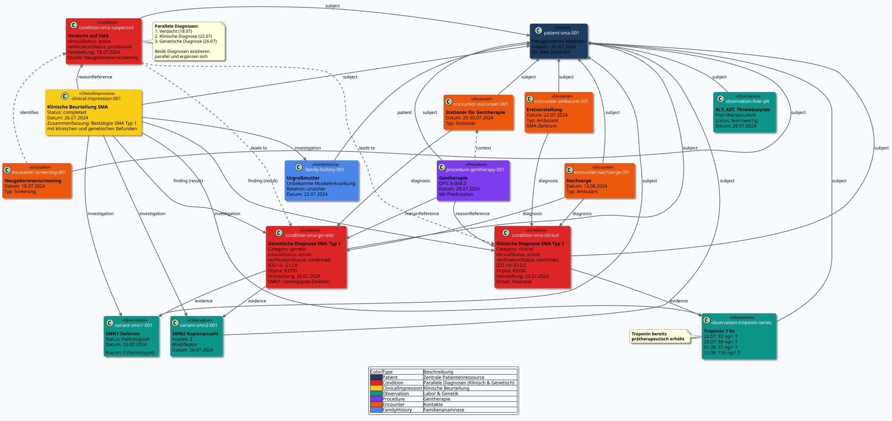

# Fallbeispiel Spinale Muskelatrophie (SMA) - MII IG Kerndatensatz-Modul Seltene Erkrankungen v2027.0.0-ballot.rc1

* [**Inhaltsverzeichnis**](toc.md)
* **Fallbeispiel Spinale Muskelatrophie (SMA)**

## Fallbeispiel Spinale Muskelatrophie (SMA)

# SMA Fallbeispiel - Semantische Annotationen

## Übersicht

Dieses Dokument enthält die semantischen Annotationen für ein Fallbeispiel einer Spinalen Muskelatrophie (SMA) bei einem Neugeborenen.

## Zeitlicher Verlauf

### 1. Neugeborenenscreening (18.07.2024)

* **Verdachtsdiagnose**: Spinale Muskelatrophie (SMA)
* **Setting**: Screening
* **Status**: Verdacht

### 2. Ambulante Erstvorstellung (22.07.2024)

* **Einweisungsdiagnose**: 
* ICD-10-GM: G12.0 "Infantile Spinale Muskelatrophie Typ 1"
* Orpha: 83330
 
* **Setting**: Ambulant
* **Zentrum**: Spezialisiertes SMA-Zentrum

### 3. Molekulargenetische Diagnostik (26.07.2024)

* **Untersuchungsmaterial**: EDTA-Blut
* **Befund**: 
* SMN1-Gen: 0 Kopien (pathologisch)
* SMN2-Gen: 2 Kopien
 
* **Interpretation**: Krankheitsursächlich
* **Bestätigung**: Klinischer Verdacht bestätigt

### 4. Stationäre Therapie (29.07.2024)

* **Behandlung**: Gentherapeutikum
* **Begleitmedikation**: Prednisolon (prätherapeutisch)
* **Prozedurcode**: 6-00d.0
* **Komplikationen**: Keine
* **Laborwerte posttherapeutisch**: 
* ALT: normwertig
* AST: normwertig
* Thrombozytenzahl: normwertig
 

### 5. Nachsorge (12.08.2024)

* **Setting**: Ambulant
* **Laborwerte**: 
* ALT: normwertig
* AST: normwertig
* Thrombozytenzahl: normwertig
* Troponin Ths: 106 ng/l (erhöht)
 
* **Troponin-Verlauf** (prä-therapeutisch): 
* 22.07.2024: 92 ng/l
* 28.07.2024: 58 ng/l
* 01.08.2024: 57 ng/l
* 12.08.2024: 106 ng/l
 

## Semantische Annotationen

### Patient

* **Geschlecht**: Weiblich
* **Geburtsdatum**: ~Juli 2024 (Neugeborenes)
* **Relevante Merkmale**: Neugeborenes mit SMA

### Familienanamnese

* **Urgroßmutter**: Unbekannte Muskelerkrankung
* **Sonstige Familie**: Unauffällig

### Diagnosen

1. **Hauptdiagnose**:
* **Bezeichnung**: Infantile Spinale Muskelatrophie Typ 1
* **ICD-10-GM**: G12.0
* **Orpha**: 83330
* **SNOMED CT**: 80854005 (Werdnig-Hoffmann disease)
* **Status**: Bestätigt durch Molekulargenetik
* **Onset**: Neonatal

### Genetische Befunde

1. **SMN1-Gen Deletion**:
* **Gen**: SMN1 (OMIM: 600354, HGNC: HGNC:11117)
* **Variante**: Homozygote Deletion
* **Kopienanzahl**: 0
* **Interpretation**: Pathologisch, krankheitsursächlich

1. **SMN2-Gen Kopienanzahl**:
* **Gen**: SMN2 (OMIM: 601627, HGNC: HGNC:11118)
* **Kopienanzahl**: 2
* **Interpretation**: Modifikator des Phänotyps

### Prozeduren

1. **Gentherapie**:
* **OPS-Code**: 6-00d.0
* **SNOMED CT**: 788110002 (Gene therapy)
* **Datum**: 29.07.2024
* **Medikament**: Onasemnogene abeparvovec (Zolgensma)
* **UNII**: MLU3LU3EVV
* **Begleitmedikation**: Prednisolon

### Laborwerte

1. **ALT (Alanin-Aminotransferase)**:
* **LOINC**: 1742-6
* **Status**: Normwertig (post-therapeutisch)

1. **AST (Aspartat-Aminotransferase)**:
* **LOINC**: 1920-8
* **Status**: Normwertig (post-therapeutisch)

1. **Thrombozytenzahl**:
* **LOINC**: 777-3
* **Status**: Normwertig (post-therapeutisch)

1. **Troponin T hs**:
* **LOINC**: 6598-7
* **Werte**: Prä-therapeutisch erhöht, steigend im Verlauf
* **Einheit**: ng/l

### Behandlungsplan

* **Gentherapie**: Einmalig verabreicht
* **Prednisolon**: Fortführung nach Entlassung
* **Nachsorge**: 
* Kinderärztliche Betreuung
* Humangenetische Beratung
* Sozialpädiatrisches Zentrum
* Zentrumsbasierte Nachsorge
 

## FHIR-Mapping

### Verwendete Profile

* **Patient**: MII KDS Patient
* **Diagnose**: MII PR SE Diagnose
* **Molekulargenetik**: MII PR MolGen Variante
* **Familienanamnese**: MII PR SE Familienanamnese
* **Laborwerte**: MII PR Labor Observation
* **Prozedur**: MII PR Prozedur
* **Encounter**: MII PR Encounter

### Ressourcen-Übersicht

#### Patient und Familienanamnese

| | | | | |
| :--- | :--- | :--- | :--- | :--- |
| `mii-exa-seltene-patient-sma-001` | Patient | Neugeborenes Mädchen | Geburt: ~01.07.2024 | ID: SMA-2024-001 |
| `mii-exa-seltene-family-history-001` | FamilyMemberHistory | Urgroßmutter mit Muskelerkrankung | 22.07.2024 | Relation: unsicher |

#### Diagnose-Verlauf

| | | | | | |
| :--- | :--- | :--- | :--- | :--- | :--- |
| `mii-exa-seltene-condition-sma-suspected` | Condition | Verdacht auf SMA | 18.07.2024 | unconfirmed | SNOMED: 80854005 |
| `mii-exa-seltene-condition-sma-clinical` | Condition | Klinische Diagnose SMA Typ 1 | 22.07.2024 | provisional | ICD-10: G12.0, Orpha: 83330 |
| `condition-sma-confirmed` | Condition | Bestätigte SMA Typ 1 | 26.07.2024 | confirmed | ICD-10: G12.0, Orpha: 83330 |

#### Screening und Genetische Befunde

| | | | | | |
| :--- | :--- | :--- | :--- | :--- | :--- |
| `mii-exa-seltene-observation-sma-screening` | Observation | SMA Neugeborenenscreening (LOINC: 92005-8) | SMN1 Exon 7 nicht nachweisbar | 18.07.2024 | Positiv für SMA |
| `mii-exa-seltene-variant-smn1-001` | Observation | SMN1 (HGNC:11117) - Konfirmatorisch | 0 Kopien (Deletion) | 26.07.2024 | Pathologisch, krankheitsursächlich |
| `mii-exa-seltene-variant-smn2-001` | Observation | SMN2 (HGNC:11118) - Konfirmatorisch | 2 Kopien | 26.07.2024 | Phänotyp-Modifikator |

#### Behandlung

| | | | | | |
| :--- | :--- | :--- | :--- | :--- | :--- |
| `mii-exa-seltene-procedure-gentherapy-001` | Procedure | Gentherapie (Onasemnogene abeparvovec) | 29.07.2024 | OPS: 6-00d.0, UNII: MLU3LU3EVV | Mit Prednisolon, ohne Komplikationen |

#### Laborwerte

| | | | | | |
| :--- | :--- | :--- | :--- | :--- | :--- |
| `mii-exa-seltene-observation-troponin-001` | Observation | Troponin T hs | 22.07.2024 | 92 ng/l | Erhöht |
| `mii-exa-seltene-observation-troponin-002` | Observation | Troponin T hs | 28.07.2024 | 58 ng/l | Erhöht |
| `mii-exa-seltene-observation-troponin-003` | Observation | Troponin T hs | 01.08.2024 | 57 ng/l | Erhöht |
| `mii-exa-seltene-observation-troponin-004` | Observation | Troponin T hs | 12.08.2024 | 106 ng/l | Erhöht |
| `mii-exa-seltene-observation-alt-001` | Observation | ALT | 29.07.2024 | - | Normwertig |
| `mii-exa-seltene-observation-ast-001` | Observation | AST | 29.07.2024 | - | Normwertig |
| `mii-exa-seltene-observation-plt-001` | Observation | Thrombozytenzahl | 29.07.2024 | - | Normwertig |

#### Behandlungskontakte

| | | | | | |
| :--- | :--- | :--- | :--- | :--- | :--- |
| `mii-exa-seltene-encounter-screening-001` | Encounter | Neugeborenenscreening | 18.07.2024 | Screening | `mii-exa-seltene-condition-sma-suspected` |
| `mii-exa-seltene-encounter-ambulant-001` | Encounter | Erstvorstellung SMA-Zentrum | 22.07.2024 | Ambulant | `mii-exa-seltene-condition-sma-clinical` |
| `mii-exa-seltene-encounter-stationaer-001` | Encounter | Stationäre Gentherapie | 29-30.07.2024 | Stationär | `condition-sma-confirmed` |
| `mii-exa-seltene-encounter-nachsorge-001` | Encounter | Nachsorge | 12.08.2024 | Ambulant | `condition-sma-confirmed` |

#### Klinische Beurteilungen

| | | | | | |
| :--- | :--- | :--- | :--- | :--- | :--- |
| `mii-exa-seltene-clinical-impression-erstvorstellung` | ClinicalImpression | Initiale klinische Beurteilung | 22.07.2024 | `mii-exa-seltene-encounter-ambulant-001` | Familienanamnese, Troponin ↑, V.a. SMA Typ 1 |
| `mii-exa-seltene-clinical-impression-nachsorge` | ClinicalImpression | Nachsorgebeurteilung nach Gentherapie | 12.08.2024 | `mii-exa-seltene-encounter-nachsorge-001` | Troponin weiter ↑ (präexistent), ALT/AST/PLT normal |

### Bundle

| | | | |
| :--- | :--- | :--- | :--- |
| `mii-exa-seltene-bundle-sma-complete` | Bundle | Transaction Bundle mit allen Ressourcen | 22 Ressourcen |

## Implementierung

Die vollständigen FHIR-Ressourcen sind in den FSH-Quellen dieses Moduls definiert (`input/fsh/Beispiel_SMA/`), inklusive Transaction Bundle.

### Ressourcen-Diagramme

#### Gesamtübersicht aller Ressourcen und Beziehungen

#### Zeitlicher Verlauf

