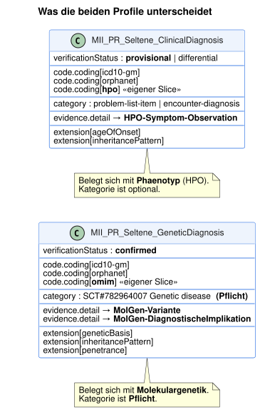
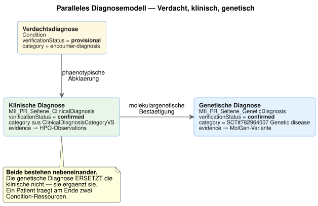
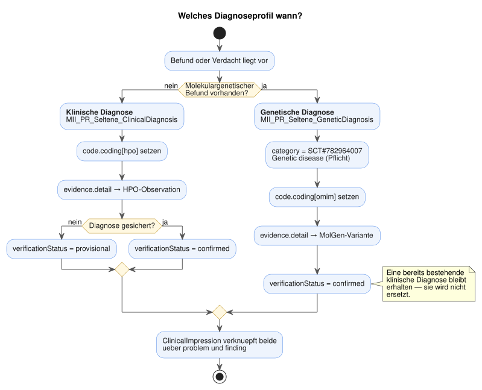

# Clinical vs. Genetic Diagnosis - MII IG Kerndatensatz-Modul Seltene Erkrankungen v2027.0.0-ballot

* [**Table of Contents**](toc.md)
* [**Guidance**](guidance.md)
* **Clinical vs. Genetic Diagnosis**

## Clinical vs. Genetic Diagnosis

### Overview

In the modeling of rare diseases we distinguish between two kinds of diagnosis:

1. **Clinical diagnosis**(`MII_PR_Seltene_ClinicalDiagnosis`) — based on phenotypic features
1. **Genetic diagnosis**(`MII_PR_Seltene_GeneticDiagnosis`) — molecularly confirmed

This distinction is important because many rare diseases are first suspected clinically and later confirmed genetically.

### Clinical diagnosis

#### Usage

The clinical diagnosis is used when:

* The diagnosis is based on clinical findings and symptoms
* Genetic testing is still pending or not available
* The diagnosis is made phenotypically (e.g. for characteristic syndromes)

#### Specifics

* **HPO codes**: additional slice `code.coding[hpo]` (0..*), required-bound to the HPO phenotype code value set
* **Phenotypic evidence**: evidence.detail references HPO-coded symptom observations
* **Verification status**: **not** constrained by the profile (0..1, inherited required binding to `condition-ver-status`); "provisional" or "differential" are recommended while genetic confirmation is pending
* **Category**: `category` is mandatory (1..*), but its value is not fixed. It states the role in the record (`problem-list-item` or `encounter-diagnosis`), not the kind of disease — a module-wide binding to disease kinds would be conceptually wrong here.

#### Structural comparison

The spelled-out instances live with the profiles themselves; what matters here is the difference, not the syntax.

### Genetic diagnosis

#### Usage

The genetic diagnosis is used when:

* The diagnosis has been confirmed by molecular genetic examination
* Pathogenic variants have been identified
* A definite genetic cause has been demonstrated

#### Specifics

* **OMIM codes**: additional slice for Online Mendelian Inheritance in Man codes
* **Genetic evidence**: `evidence` is mandatory (1..**), `evidence.detail` (1..**) references an Observation or DiagnosticReport. The profile does not constrain the target profiles; the MolGen resources are recommended: 
* `MII_PR_MolGen_Variante` for individual variants
* `MII_PR_MolGen_DiagnostischeImplikation` for comprehensive genetic reports
 
* **Genetic evidence marker**: `evidence.code.coding[geneticEvidence]` carries `106221001 | Genetic finding |`
* **Verification status**: **not** constrained by the profile; "confirmed" is recommended
* **Additional genetic information**: `penetrance` extension
* **Category**: MANDATORY: `782964007 | Genetic disease |` for unambiguous labeling

### Parallel diagnosis model

In rare diseases, clinical and genetic diagnoses exist **in parallel**:

The diagram shows all three stages: the suspected diagnosis from screening or first contact, the clinical diagnosis after phenotypic work-up, and the genetic diagnosis after molecular confirmation.

**Important:** The genetic diagnosis does NOT replace the clinical diagnosis. Both exist in parallel and complement each other.

### Decision tree

The ClinicalImpression links the stages: problem → suspected diagnosis, finding → clinical diagnosis, finding → genetic diagnosis, investigation → examinations.

### Practical notes

#### When to use which profile?

| | | |
| :--- | :--- | :--- |
| Newborn screening positive | ClinicalDiagnosis | unconfirmed |
| Clinically unambiguous syndrome | ClinicalDiagnosis | provisional |
| Genetically confirmed | GeneticDiagnosis | confirmed |
| Clinically + genetically confirmed | **Both profiles in parallel** | confirmed |
| **Excluded diagnosis** | Corresponding profile | **refuted** |
| Differential diagnosis | ClinicalDiagnosis | differential |

#### Linking diagnoses via ClinicalImpression

The **ClinicalImpression** links the different diagnostic stages:

1. **problem**: reference to the suspected diagnosis (reason for the examination)
1. **finding**: references to the confirmed diagnoses (clinical AND genetic)
1. **investigation**: references to the examinations performed

Both diagnoses remain as independent resources and document different aspects of the same disease.

#### Evidence linking

**Clinical diagnosis:**

* Evidence → Observation with HPO-coded symptoms
* Evidence → DiagnosticReport with clinical findings
* Evidence → ClinicalImpression with clinical assessment

**Genetic diagnosis:**

* Evidence → MolGen variant (Observation)
* Evidence → MolGen diagnostic implication (DiagnosticReport)
* Evidence → MolGen examined region (Observation)

### Validation

#### Checklist, clinical diagnosis

* `category` set — **mandatory** (1..*)
* HPO code in `code.coding[hpo]` where the phenotype is known (the profile does not enforce it, but for rare diseases it carries the actual content)
* `evidence.detail` referencing phenotypic observations
* Appropriate `verificationStatus`

#### Checklist, genetic diagnosis

* `category` = `782964007 | Genetic disease |` — **mandatory**, fixed value
* At least one `evidence` with `evidence.detail` — **mandatory** (1..*)
* OMIM code if available
* `evidence.code.coding[geneticEvidence]` = `106221001 | Genetic finding |`
* `verificationStatus = confirmed` for a confirmed diagnosis

### Excluded diagnoses

#### Important note

**Excluded diagnoses (refuted) MUST also be documented!**

For rare diseases, the documentation of excluded diagnoses is essential for:

* Avoiding redundant diagnostics
* Documenting the diagnostic process
* Supporting differential diagnoses
* Research and registry data

#### Modeling excluded diagnoses

Excluded diagnoses use the same profile as confirmed ones; only the status differs:

| | | |
| :--- | :--- | :--- |
| Profile | `MII_PR_Seltene_ClinicalDiagnosis` | `MII_PR_Seltene_GeneticDiagnosis` |
| `verificationStatus` | `refuted` | `refuted` |
| `clinicalStatus` | `inactive` | `inactive` |
| Justification | `note.text` | `note.text` |
| Evidence | negative phenotypic finding | negative molecular finding |

#### Best practices for excluded diagnoses

1. **Always document when:**
* A suspected diagnosis has been refuted
* Genetic tests are negative
* Differential diagnoses are excluded

1. **Mandatory information:**
* `verificationStatus = refuted`
* `clinicalStatus = inactive`
* Justification in `note.text`
* Evidence if available

1. **Temporal documentation:**
* `recordedDate`: when it was excluded
* `abatementDateTime`: time of exclusion

### Examples

Complete examples can be found in:

* [SMA case example](sma-example-annotations.md) — diagnostic course from screening to genetic confirmation
* [Marfan case example](marfan-example-annotations.md) — clinical diagnosis with phenotypic features

