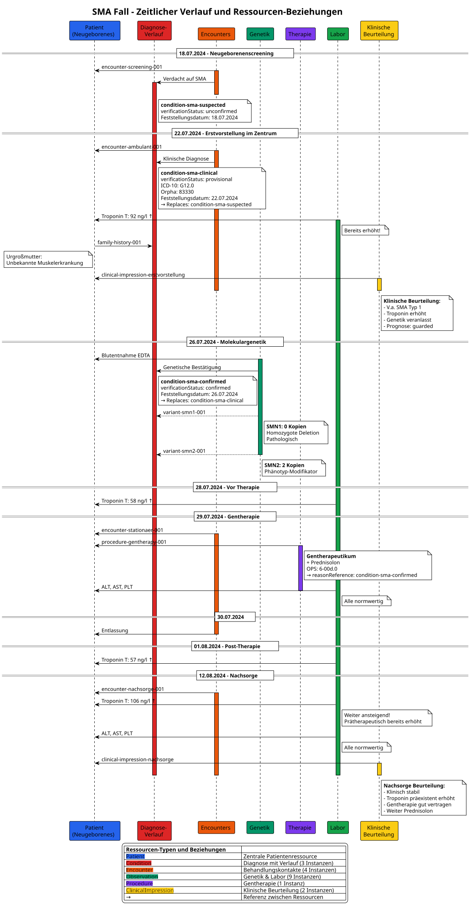

# Case Example Spinal Muscular Atrophy (SMA) - MII IG Kerndatensatz-Modul Seltene Erkrankungen v2027.0.0-ballot.rc1

* [**Table of Contents**](toc.md)
* **Case Example Spinal Muscular Atrophy (SMA)**

## Case Example Spinal Muscular Atrophy (SMA)

### Overview

This document contains the semantic annotations for a case example of spinal muscular atrophy (SMA) in a newborn.

### Timeline

#### 1. Newborn screening (2024-07-18)

* **Suspected diagnosis**: spinal muscular atrophy (SMA)
* **Setting**: screening
* **Status**: suspected

#### 2. Outpatient first presentation (2024-07-22)

* **Admission diagnosis**: 
* ICD-10-GM: G12.0 "Infantile spinal muscular atrophy type 1"
* Orpha: 83330
 
* **Setting**: outpatient
* **Center**: specialized SMA center

#### 3. Molecular genetic diagnostics (2024-07-26)

* **Specimen**: EDTA blood
* **Findings**: 
* SMN1 gene: 0 copies (pathological)
* SMN2 gene: 2 copies
 
* **Interpretation**: disease-causing
* **Confirmation**: clinical suspicion confirmed

#### 4. Inpatient therapy (2024-07-29)

* **Treatment**: gene therapeutic
* **Concomitant medication**: prednisolone (pre-therapeutic)
* **Procedure code**: 6-00d.0
* **Complications**: none
* **Post-therapeutic laboratory values**: 
* ALT: normal
* AST: normal
* Platelet count: normal
 

#### 5. Follow-up (2024-08-12)

* **Setting**: outpatient
* **Laboratory values**: 
* ALT: normal
* AST: normal
* Platelet count: normal
* Troponin T hs: 106 ng/l (elevated)
 
* **Troponin course** (pre-therapeutic): 
* 2024-07-22: 92 ng/l
* 2024-07-28: 58 ng/l
* 2024-08-01: 57 ng/l
* 2024-08-12: 106 ng/l
 

### Semantic annotations

#### Patient

* **Sex**: female
* **Date of birth**: ~July 2024 (newborn)
* **Relevant characteristics**: newborn with SMA

#### Family history

* **Great-grandmother**: unknown muscle disease
* **Rest of family**: unremarkable

#### Diagnoses

1. **Main diagnosis**:
* **Name**: infantile spinal muscular atrophy type 1
* **ICD-10-GM**: G12.0
* **Orpha**: 83330
* **SNOMED CT**: 80854005 (Werdnig-Hoffmann disease)
* **Status**: confirmed by molecular genetics
* **Onset**: neonatal

#### Genetic findings

1. **SMN1 gene deletion**:
* **Gene**: SMN1 (OMIM: 600354, HGNC: HGNC:11117)
* **Variant**: homozygous deletion
* **Copy number**: 0
* **Interpretation**: pathological, disease-causing

1. **SMN2 gene copy number**:
* **Gene**: SMN2 (OMIM: 601627, HGNC: HGNC:11118)
* **Copy number**: 2
* **Interpretation**: phenotype modifier

#### Procedures

1. **Gene therapy**:
* **OPS code**: 6-00d.0
* **SNOMED CT**: 788110002 (Gene therapy)
* **Date**: 2024-07-29
* **Drug**: onasemnogene abeparvovec (Zolgensma)
* **UNII**: MLU3LU3EVV
* **Concomitant medication**: prednisolone

#### Laboratory values

1. **ALT (alanine aminotransferase)**:
* **LOINC**: 1742-6
* **Status**: normal (post-therapeutic)

1. **AST (aspartate aminotransferase)**:
* **LOINC**: 1920-8
* **Status**: normal (post-therapeutic)

1. **Platelet count**:
* **LOINC**: 777-3
* **Status**: normal (post-therapeutic)

1. **Troponin T hs**:
* **LOINC**: 6598-7
* **Values**: elevated pre-therapeutically, rising over time
* **Unit**: ng/l

#### Treatment plan

* **Gene therapy**: administered once
* **Prednisolone**: continued after discharge
* **Follow-up**: 
* Pediatric care
* Human genetic counseling
* Social-pediatric center
* Center-based follow-up
 

### FHIR mapping

#### Profiles used

* **Patient**: MII KDS Patient
* **Diagnosis**: MII PR SE Diagnose
* **Molecular genetics**: MII PR MolGen Variante
* **Family history**: MII PR SE Familienanamnese
* **Laboratory values**: MII PR Labor Observation
* **Procedure**: MII PR Prozedur
* **Encounter**: MII PR Encounter

#### Resource overview

##### Patient and family history

| Resource ID | Type | Description | Date | Status/details | |————–|—–|————–|——-|—————-| | `patient-sma-001` | Patient | Newborn girl | Birth: ~2024-07-01 | ID: SMA-2024-001 | | `family-history-001` | FamilyMemberHistory | Great-grandmother with muscle disease | 2024-07-22 | Relation: uncertain |

##### Diagnosis course

| Resource ID | Type | Description | Date of determination | Verification status | Codes | |————–|—–|————–|——————-|——————-|——–| | `condition-sma-suspected` | Condition | Suspected SMA | 2024-07-18 | unconfirmed | SNOMED: 80854005 | | `condition-sma-clinical` | Condition | Clinical diagnosis SMA type 1 | 2024-07-22 | provisional | ICD-10: G12.0, Orpha: 83330 | | `condition-sma-confirmed` | Condition | Confirmed SMA type 1 | 2024-07-26 | confirmed | ICD-10: G12.0, Orpha: 83330 |

##### Screening and genetic findings

| Resource ID | Type | Test/gene | Finding | Date | Interpretation | |————–|—–|———-|———|——-|—————-| | `observation-sma-screening` | Observation | SMA newborn screening (LOINC: 92005-8) | SMN1 exon 7 not detectable | 2024-07-18 | Positive for SMA | | `variant-smn1-001` | Observation | SMN1 (HGNC:11117) — confirmatory | 0 copies (deletion) | 2024-07-26 | Pathological, disease-causing | | `variant-smn2-001` | Observation | SMN2 (HGNC:11118) — confirmatory | 2 copies | 2024-07-26 | Phenotype modifier |

##### Treatment

| Resource ID | Type | Description | Date | Code | Details | |————–|—–|————–|——-|——|———| | `procedure-gentherapy-001` | Procedure | Gene therapy (onasemnogene abeparvovec) | 2024-07-29 | OPS: 6-00d.0, UNII: MLU3LU3EVV | With prednisolone, without complications |

##### Laboratory values

| Resource ID | Type | Parameter | Date | Value | Interpretation | |————–|—–|———–|——-|——|—————-| | `observation-troponin-001` | Observation | Troponin T hs | 2024-07-22 | 92 ng/l | Elevated | | `observation-troponin-002` | Observation | Troponin T hs | 2024-07-28 | 58 ng/l | Elevated | | `observation-troponin-003` | Observation | Troponin T hs | 2024-08-01 | 57 ng/l | Elevated | | `observation-troponin-004` | Observation | Troponin T hs | 2024-08-12 | 106 ng/l | Elevated | | `observation-alt-001` | Observation | ALT | 2024-07-29 | - | Normal | | `observation-ast-001` | Observation | AST | 2024-07-29 | - | Normal | | `observation-plt-001` | Observation | Platelet count | 2024-07-29 | - | Normal |

##### Encounters

| Resource ID | Type | Description | Date | Setting | Linked diagnosis | |————–|—–|————–|——-|———|——————-| | `encounter-screening-001` | Encounter | Newborn screening | 2024-07-18 | Screening | `condition-sma-suspected` | | `encounter-ambulant-001` | Encounter | First presentation SMA center | 2024-07-22 | Outpatient | `condition-sma-clinical` | | `encounter-stationaer-001` | Encounter | Inpatient gene therapy | 2024-07-29/30 | Inpatient | `condition-sma-confirmed` | | `encounter-nachsorge-001` | Encounter | Follow-up | 2024-08-12 | Outpatient | `condition-sma-confirmed` |

##### Clinical assessments

| Resource ID | Type | Description | Date | Encounter | Key findings | |————–|—–|————–|——-|———–|——————| | `clinical-impression-erstvorstellung` | ClinicalImpression | Initial clinical assessment | 2024-07-22 | `encounter-ambulant-001` | Family history, troponin ↑, suspected SMA type 1 | | `clinical-impression-nachsorge` | ClinicalImpression | Follow-up assessment after gene therapy | 2024-08-12 | `encounter-nachsorge-001` | Troponin still ↑ (pre-existing), ALT/AST/PLT normal |

#### Bundle

| Resource ID | Type | Description | Number of entries | |————–|—–|————–|—————–| | `bundle-sma-complete` | Bundle | Transaction bundle with all resources | 22 resources |

### Resource diagrams

#### Overall view of all resources and their relationships

#### Timeline

### Implementation

The complete FHIR resources are defined in the FSH sources of this module (`input/fsh/Beispiel_SMA/`), including the transaction bundle.

