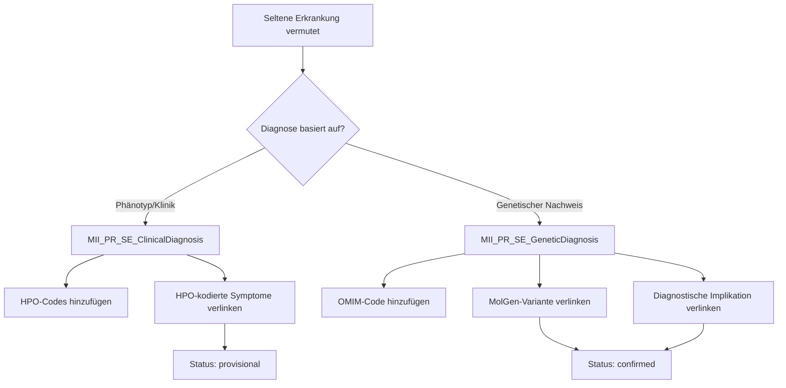

# Leitfaden: Klinische vs. Genetische Diagnose bei Seltenen Erkrankungen

## Übersicht

In der Modellierung seltener Erkrankungen unterscheiden wir zwischen zwei Arten der Diagnosestellung:

1. **Klinische Diagnose** (`MII_PR_SE_ClinicalDiagnosis`) - Basierend auf phänotypischen Merkmalen
2. **Genetische Diagnose** (`MII_PR_SE_GeneticDiagnosis`) - Molekulargenetisch bestätigt

Diese Unterscheidung ist wichtig, da viele seltene Erkrankungen zunächst klinisch vermutet und später genetisch bestätigt werden.

## Klinische Diagnose

### Verwendung
Die klinische Diagnose wird verwendet, wenn:
- Die Diagnose auf klinischen Befunden und Symptomen basiert
- Eine genetische Testung noch aussteht oder nicht verfügbar ist
- Die Diagnose phänotypisch gestellt wird (z.B. bei charakteristischen Syndromen)

### Besonderheiten
- **HPO-Codes**: Zusätzlicher Slice für Human Phenotype Ontology Codes
- **Phänotypische Evidenz**: Evidence.detail verweist auf HPO-kodierte Symptom-Observations
- **Verifikationsstatus**: Typischerweise "provisional" oder "differential"
- **Kategorie**: Optional spezifische Kategorisierung (z.B. "Syndrome", "Rare disease")

### Beispiel FSH
```fsh
Instance: marfan-clinical-diagnosis
InstanceOf: MII_PR_SE_ClinicalDiagnosis
* verificationStatus = $condition-ver-status#provisional
* category[+] = $condition-category#encounter-diagnosis
* category[clinical] = $SCT#47367009 "Syndrome"
* code.coding[icd10-gm] = $ICD10GM#Q87.4 "Marfan-Syndrom"
* code.coding[orphanet] = http://www.orpha.net#558 "Marfan syndrome"
* code.coding[hpo] = http://hpo.jax.org/app/#HP:0008138 "Marfan syndrome"
* evidence[+].detail = Reference(observation-aortic-dilatation)  // HPO: HP:0002616
* evidence[+].detail = Reference(observation-lens-dislocation)   // HPO: HP:0001083
* evidence[+].detail = Reference(observation-tall-stature)       // HPO: HP:0000098
* extension[ageOfOnset].valueCodeableConcept = http://hpo.jax.org/app/#HP:0003577 "Congenital onset"
* extension[inheritancePattern].valueCodeableConcept = http://hpo.jax.org/app/#HP:0000006 "Autosomal dominant"
```

## Genetische Diagnose

### Verwendung
Die genetische Diagnose wird verwendet, wenn:
- Die Diagnose durch molekulargenetische Untersuchung bestätigt wurde
- Pathogene Varianten identifiziert wurden
- Eine eindeutige genetische Ursache nachgewiesen ist

### Besonderheiten
- **OMIM-Codes**: Zusätzlicher Slice für Online Mendelian Inheritance in Man Codes
- **MolGen-Evidenz**: Evidence.detail MUSS auf MolGen-Ressourcen verweisen:
  - `MII_PR_MolGen_Variante` für einzelne Varianten
  - `MII_PR_MolGen_DiagnostischeImplikation` für umfassende genetische Berichte
- **Verifikationsstatus**: Typischerweise "confirmed"
- **Genetische Zusatzinformationen**: Penetranz, genetische Basis
- **Kategorie**: PFLICHT: `782964007 | Genetic disease |` zur eindeutigen Kennzeichnung

### Beispiel FSH
```fsh
Instance: sma-genetic-diagnosis
InstanceOf: MII_PR_SE_GeneticDiagnosis
* verificationStatus = $condition-ver-status#confirmed
* category[+] = $condition-category#encounter-diagnosis
* category[genetic] = $SCT#782964007 "Genetic disease"
* code.coding[icd10-gm] = $ICD10GM#G12.0 "Infantile spinale Muskelatrophie, Typ I"
* code.coding[orphanet] = http://www.orpha.net#83330 "SMA type 1"
* code.coding[omim] = http://omim.org#253300 "Spinal muscular atrophy, type I"
* evidence[+].code = $SCT#410545006 "Genetic finding"
* evidence[=].detail = Reference(variant-smn1-deletion)  // MolGen Variante
* evidence[+].detail = Reference(diagnostic-report-sma)   // MolGen DiagnostischeImplikation
* extension[geneticBasis].valueCodeableConcept = $SCT#264530000 "Single gene disorder"
* extension[inheritancePattern].valueCodeableConcept = http://hpo.jax.org/app/#HP:0000007 "Autosomal recessive"
* extension[penetrance].valueCodeableConcept = http://hpo.jax.org/app/#HP:0025169 "Complete penetrance"
```

## Diagnose-Verlauf modellieren

Bei vielen seltenen Erkrankungen durchläuft die Diagnose mehrere Stadien:

### 1. Verdachtsdiagnose (Screening/Initial)
```fsh
* verificationStatus = #unconfirmed
* category = #encounter-diagnosis
```

### 2. Klinische Diagnose
```fsh
* verificationStatus = #provisional
* extension[replaces].valueReference = Reference(verdachts-diagnose)
```

### 3. Genetisch bestätigte Diagnose
```fsh
* verificationStatus = #confirmed
* extension[replaces].valueReference = Reference(klinische-diagnose)
```

## Entscheidungsbaum



## Praktische Hinweise

### Wann welches Profil verwenden?

| Situation | Profil | Verifikationsstatus |
|-----------|--------|-------------------|
| Neugeborenenscreening positiv | ClinicalDiagnosis | unconfirmed |
| Klinisch eindeutiges Syndrom | ClinicalDiagnosis | provisional |
| Genetisch bestätigt | GeneticDiagnosis | confirmed |
| Klinisch + genetisch bestätigt | Beide Profile | confirmed |
| **Ausgeschlossene Diagnose** | Entsprechendes Profil | **refuted** |
| Differentialdiagnose | ClinicalDiagnosis | differential |

### Verlinkung zwischen Diagnosen

Wenn sowohl eine klinische als auch eine genetische Diagnose existiert:

1. Erste Ressource: Klinische Diagnose
2. Zweite Ressource: Genetische Diagnose mit `replaces` Extension zur klinischen Diagnose
3. Beide Ressourcen bleiben erhalten für vollständige Dokumentation

### Evidence-Verlinkung

**Klinische Diagnose:**
- Evidence → Observation mit HPO-kodierten Symptomen
- Evidence → DiagnosticReport mit klinischen Befunden
- Evidence → ClinicalImpression mit klinischer Beurteilung

**Genetische Diagnose:**
- Evidence → MolGen Variante (Observation)
- Evidence → MolGen DiagnostischeImplikation (DiagnosticReport)
- Evidence → MolGen Untersuchte Region (Observation)

## Validierung

### Pflichtfelder Klinische Diagnose
- [ ] Mindestens ein HPO-Code im code.coding Slice
- [ ] Evidence.detail mit Verweis auf phänotypische Observations
- [ ] Angemessener verificationStatus

### Pflichtfelder Genetische Diagnose
- [ ] OMIM-Code wenn verfügbar
- [ ] Mindestens eine evidence.detail zu MolGen-Ressource
- [ ] verificationStatus = confirmed (bei bestätigter Diagnose)
- [ ] evidence.code mit "Genetic finding"

## Ausgeschlossene Diagnosen

### Wichtiger Hinweis
**Ausgeschlossene Diagnosen (refuted) MÜSSEN ebenfalls dokumentiert werden!**

Bei seltenen Erkrankungen ist die Dokumentation ausgeschlossener Diagnosen essentiell für:
- Vermeidung redundanter Diagnostik
- Dokumentation des diagnostischen Prozesses
- Unterstützung bei Differentialdiagnosen
- Forschung und Registerdaten

### Modellierung ausgeschlossener Diagnosen

#### Klinisch ausgeschlossen
```fsh
Instance: marfan-excluded-clinical
InstanceOf: MII_PR_SE_ClinicalDiagnosis
* verificationStatus = $condition-ver-status#refuted
* clinicalStatus = $condition-clinical#inactive
* category[clinical] = $SCT#47367009 "Syndrome"
* code.coding[icd10-gm] = $ICD10GM#Q87.4 "Marfan-Syndrom"
* code.coding[orphanet] = http://www.orpha.net#558 "Marfan syndrome"
* note.text = "Marfan-Syndrom klinisch ausgeschlossen. Ghent-Kriterien nicht erfüllt."
```

#### Genetisch ausgeschlossen
```fsh
Instance: sma-excluded-genetic
InstanceOf: MII_PR_SE_GeneticDiagnosis
* verificationStatus = $condition-ver-status#refuted
* clinicalStatus = $condition-clinical#inactive
* category[genetic] = $SCT#782964007 "Genetic disease"
* code.coding[orphanet] = http://www.orpha.net#83330 "SMA"
* code.coding[omim] = http://omim.org#253300 "SMA type I"
* evidence[+].code = $SCT#410545006 "Genetic finding"
* evidence[=].detail = Reference(molgen-smn1-normal)
* note.text = "SMN1-Gen normal (2 Kopien). SMA ausgeschlossen."
```

### Best Practices für ausgeschlossene Diagnosen

1. **Immer dokumentieren wenn:**
   - Eine Verdachtsdiagnose widerlegt wurde
   - Genetische Tests negativ sind
   - Differentialdiagnosen ausgeschlossen werden

2. **Pflichtangaben:**
   - `verificationStatus = refuted`
   - `clinicalStatus = inactive`
   - Begründung in `note.text`
   - Evidence wenn vorhanden

3. **Zeitliche Dokumentation:**
   - `recordedDate`: Wann wurde ausgeschlossen
   - `abatementDateTime`: Zeitpunkt des Ausschlusses

## Beispiele

Vollständige Beispiele finden sich in:
- [SMA-Fallbeispiel](sma-example-annotations.html) - Diagnose-Verlauf von Screening bis genetischer Bestätigung
- [Marfan-Fallbeispiel](marfan-example-annotations.html) - Klinische Diagnose mit phänotypischen Merkmalen
- [Ausgeschlossene Diagnosen](excluded-diagnosis-examples.html) - Beispiele für refuted Diagnosen